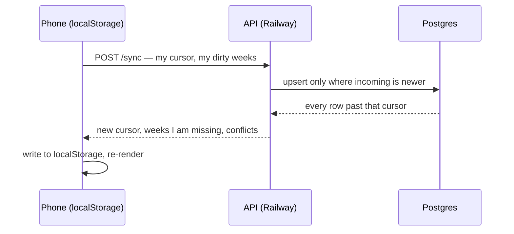

# Sync design — same planner on phone and laptop

**Status:** design agreed 2026-07-15 (§11), implementation not started. The cost of the
simple model is in [Failure modes](#7-failure-modes-read-this-bit) — that section is the
one to argue with.

## 1. Goal and non-goals

**Goal.** Edit the planner on a phone or a laptop and see the same thing on both, without
thinking about it. Keep working with no signal.

**Non-goals**, deliberately:

| Not doing | Why |
| --- | --- |
| Accounts, signup, email, password reset | One person uses this. A passcode is enough, and every one of those is a thing that can leak or break. |
| Real-time push between devices | Sync on open, on change, on reconnect is enough for two devices you don't hold at once. |
| Merging simultaneous edits to the same week | See §7. This is the real cost of the simple design. |
| Sharing with other people | Different product. Would need real auth and a duty of care over someone else's data. |

**Sync stays optional.** With no passcode entered, the planner behaves exactly as it does
today: local-only, offline, nothing uploaded. That's the fallback if any of this misbehaves.

## 2. Constraints we don't get to choose

These are inherited and non-negotiable. They shape everything below.

1. **The login must be a form typed inside the app.** Not a magic link, not "Sign in with
   Google". On iOS those authenticate in Safari, and an installed home-screen app has a
   *separate storage partition* — so the session lands somewhere the app cannot see it and
   it stays logged out. This is a longstanding iOS limitation, not a bug we can fix.
2. **`localStorage` stays the source of truth on the device.** The server is a replica, not
   the origin. This is what keeps the planner working on the Tube.
3. **The page is static, on a different origin** (`angela3famuz.github.io`) to the API
   (Railway). So: CORS, and no cookies.
4. **No build step, no dependencies.** The sync client is plain `fetch` in `index.html`.
5. **iOS Safari deletes localStorage after 7 days** without a visit (home-screen installs
   exempt). Sync actually *fixes* this: if local data is wiped, it re-pulls.

## 3. Shape of it



One endpoint, one round trip, both directions. Chosen over separate `GET`/`PUT` because
sync is always bidirectional here, and one request is easier to reason about, retry, and
rate-limit.

## 4. Auth

```
POST /auth  { "passcode": "…" }  ->  { "token": "<32 random bytes, base64url>" }
```

- The passphrase is compared against an **scrypt hash held in an env var**. Not in the
  database — there's one passphrase, and a table implies users we don't have. scrypt because
  it's in Node core: no native module to build on Railway, one less dependency to trust with
  the one secret that matters.
- The token is opaque and long-lived, stored in `localStorage` as `wp-token`, and sent as
  `Authorization: Bearer …`. **A header, not a cookie** — which means CSRF is structurally
  impossible and we never need `credentials: 'include'`.
- Tokens are stored **hashed (SHA-256)** in `tokens`. They're 256-bit random, so they can't
  be guessed and don't need a slow KDF. Hashing at rest means a database leak doesn't hand
  someone a working session.
- `DELETE /tokens` revokes all of them — the "sign out everywhere" button, and what you'd
  reach for if a device went missing.

**The passcode is the only thing protecting your schedule.** It needs to be a passphrase
(four random words), not a PIN. A 4-digit PIN is 10,000 guesses; rate limiting slows that
down but doesn't make it safe. See §11.

## 5. Data model

```sql
create sequence sync_seq;

-- One row per week. The doc is exactly what localStorage holds today.
create table weeks (
  week_iso   date primary key,
  doc        jsonb  not null,
  deleted    boolean not null default false,  -- tombstone; see §7
  updated_at bigint not null,                 -- CLIENT clock, ms. Resolves conflicts.
  seq        bigint not null                  -- SERVER counter. Drives transport.
);
create index on weeks (seq);

-- Habits, categories, active category: small, global, changes rarely.
create table settings (
  id         int primary key default 1,
  doc        jsonb not null,
  updated_at bigint not null,
  seq        bigint not null
);

create table tokens (
  token_hash text primary key,
  created_at timestamptz not null default now(),
  last_seen  timestamptz
);
```

### Why two different clocks

This is the one subtle decision in the design, so it's worth being explicit:

- **`seq` (server) answers "what changed since I last looked?"** It's a monotonic counter
  bumped on every write. Immune to client clocks. Used for transport.
- **`updated_at` (client) answers "who wins?"** Only used to compare two versions of the
  *same* week. Vulnerable to clock skew (§7).

Using the server clock for both would be wrong: the server has no idea *when the user
actually made the edit*, only when it heard about it — so an old edit syncing late would
beat a newer one made on the other device.

`wp-tab` is UI state and is **not** synced. Nobody wants their laptop's tab jumping because
their phone opened the Schedule.

## 6. The sync protocol

```
POST /sync
Authorization: Bearer <token>

{
  "since": 481,
  "weeks": {                                   // only weeks dirty since last sync
    "2026-07-13": { "focus": "…", "blocks": [...], "updatedAt": 1752600000000 }
  },
  "settings": { "habits": [...], "cats": [...], "activeCat": "job1", "updatedAt": … } | null
}

200
{
  "now": 495,                                  // new cursor; client stores this
  "weeks": {                                   // anything with seq > since, post-resolution
    "2026-07-20": { … }
  },
  "settings": { … } | null,
  "conflicts": ["2026-07-13"]                  // server copy won; client must overwrite
}
```

**Server, per incoming week** — the whole algorithm:

```js
const stored = await getWeek(weekIso)
if (!stored || incoming.updatedAt > stored.updatedAt) {
  await upsert(weekIso, incoming, nextval('sync_seq'))   // client wins
} else {
  conflicts.push(weekIso)                                // server wins; it'll be
}                                                        // returned by the seq query
```

Then return every row with `seq > since`. A week the client just pushed comes back too (its
`seq` is now above `since`) — usually harmless, it's identical to what's local. But see the
race below, because "usually" isn't good enough.

**Client, on response — the ordering matters:**

```js
for (const [weekIso, incoming] of Object.entries(res.weeks)) {
  const local = readWeek(weekIso)
  // Never let a response clobber an edit made WHILE the request was in flight.
  if (!local || incoming.updatedAt >= local.updatedAt) {
    writeWeek(weekIso, incoming)
    clearDirty(weekIso)
  }
  // else: local is newer, leave it dirty, it goes up next round
}
setCursor(res.now)
if (res.conflicts.length) notifyConflicts(res.conflicts)   // §7
render()
```

That guard is not optional. Without it: you push week X, then edit week X again before the
response lands, and the echo of your own push overwrites the edit you just made. A ~200ms
window that would silently eat keystrokes — and it'd be blamed on "sync being flaky" rather
than diagnosed. The rule is *never apply a version older than what's on the device*.

A conflict still overwrites correctly: the server only wins when its `updatedAt >=` the
incoming one, so the returned copy passes the guard.

### When sync runs

| Trigger | Why |
| --- | --- |
| App open / `visibilitychange` to visible | The main one. Picks up the other device. |
| `online` event | Flush what accumulated offline. |
| 2s debounce after a local change | Don't fire on every keystroke in the notes field. |
| Every 60s while the tab is visible **and** dirty | Backstop. |

Failures are not errors — mark dirty, retry with exponential backoff (2s → 60s cap). Being
offline is the normal case, not an exception.

### Dirty tracking

`save()` already runs on every mutation. It gains two lines: stamp
`data.updatedAt = Date.now()`, and add the week to `wp-dirty` (a small array in
localStorage, so it survives being killed mid-edit).

## 7. Failure modes (read this bit)

The design is simple on purpose. Here's exactly what that costs.

### Editing the same week on two devices loses one side's changes

**Concretely:** on the train you tick "Groceries" on your phone (offline). At home you add
a Thursday block to the same week on your laptop, which syncs. Your phone reconnects. The
phone's `updatedAt` is later, so **the phone wins and the Thursday block vanishes.**

Not a bug — it's per-week last-write-wins, working as designed. Weeks are the unit; the
whole week is replaced.

Why accept it: two devices, one person, rarely at once. The fix is per-entity `updatedAt`
(every to-do, block and priority gets an id and its own timestamp) or CRDTs — several times
the code and a much larger surface to get subtly wrong. Not worth it until it actually
bites.

**Mitigation that is worth it now:** when the server wins, don't fail silently. Say
"This week was changed on another device — that version was kept", so a surprise is at
least explained. The upgrade path to per-entity resolution stays open; the wire format
doesn't need to change.

### Clock skew picks the wrong winner

`updated_at` is the client's clock. A device 10 minutes fast wins every conflict. Phones
are NTP-synced so skew is normally seconds, but a manually-set clock breaks resolution.

Guard: **reject** (`400`) any `updatedAt` more than 5 minutes ahead of server time, and show
"This device's clock is wrong, so syncing is paused".

Not *clamp*. Clamping looks gentler and is worse: the server would hold a timestamp the
client doesn't have, the client would decline the older copy coming back (per the guard in
§6), and the two would sit permanently disagreeing with no error anywhere. A fast clock
should break loudly and locally, not diverge quietly. Local editing carries on regardless.

### "Replace all" restore vs sync

Restoring a backup with **Replace all** deletes local weeks. Without tombstones the next
sync happily re-downloads them from the server — the restore appears to undo itself.

Hence `deleted boolean` on `weeks`. Replace-all marks removed weeks deleted with a fresh
`updatedAt` and pushes them, and the server keeps the row as a tombstone. Rows are never
hard-deleted, so a device that's been offline for a month still learns about it.

### Everything else

| If | Then |
| --- | --- |
| Railway is down or asleep | The planner keeps working, fully. It syncs when it's back. Nothing is lost, nothing is blocked. |
| Passcode leaks | Someone can read and write your schedule. Rotate the env var; `DELETE /tokens` kills every session. |
| Two tabs open on one device | Same LWW applies. Last save wins. Same as today, sync doesn't make it worse. |
| A week's JSON is enormous | Body cap of 1MB. A year of blocks is a few hundred KB, so this is a runaway guard, not a real limit. |

## 8. Security

- HTTPS only (Railway provides it).
- CORS: allowlist exactly `https://angela3famuz.github.io`. Not `*`.
- Bearer token in a header ⇒ no cookies ⇒ no CSRF.
- `POST /auth` rate limited hard: 5 attempts per 15 min per IP, plus a global counter so
  rotating IPs doesn't trivially defeat it. This is the brute-force surface.
- `POST /sync` rate limited gently (say 60/min) — it's authenticated, this is just a runaway
  guard.
- Constant-time comparison on the passcode hash.
- Never log request bodies. **The schedule is personal data** even though there's only one
  user — where someone works, and when they're not home.
- No `user_id` column. If this ever became multi-user, adding one plus a `where user_id = $1`
  is a small migration — but it would need real auth first, so it's not a decision being
  deferred cheaply, it's a different project.

## 9. Migration and first run

1. **Take a backup first** (⋯ → Download backup). Non-negotiable, and the reason backup
   shipped before sync.
2. Existing weeks have no `updatedAt`. On first load after the update, stamp every existing
   week with `Date.now()`.
3. First sync from the device that has the real data: cursor is 0, server is empty, so
   everything is pushed. Nothing can be lost — there's nothing on the server to lose to.
4. Second device: enter the same passcode. Cursor 0, so it pulls everything.
   - **Careful:** if the second device already has weeks of its own, LWW applies immediately
     and whichever side is older loses that week. Back up both devices first, or start the
     second device from a fresh browser.

## 10. Rollout

Each phase is independently useful and independently abandonable.

| Phase | What | Done when |
| --- | --- | --- |
| **2a** | Schema, service, `/auth`, `/sync`, rate limits, CORS | Driveable entirely with `curl`. No client changes at all. |
| **2b** | Client: passcode entry in the ⋯ sheet, manual "Sync now", status line | Two devices converge when you press a button. |
| **2c** | Dirty tracking, debounce, `online`/`visibilitychange` triggers, backoff | You stop pressing the button. |
| **2d** | Conflict surfacing, "sign out everywhere", tombstones for replace-all | Surprises are explained rather than mysterious. |

Stopping after 2b would already meet the goal, just manually. That's the point of the split.

## 11. Decisions

Settled 2026-07-15. These are now assumptions, not questions.

1. **Passphrase, not a PIN.** Four random words (~44 bits). Typed once per device.
   **Nobody types it but you**: `server/tools/hash-passphrase.js` reads it locally, echoes
   nothing, and prints only the hash to paste into Railway. The passphrase itself never
   appears in this repo, in a chat, or in a log.
2. **Separate Railway service, separate database.** Not shared with The Village. Costs a
   little more; keeps two unrelated apps from sharing a blast radius or a deploy.
3. **Sync status stays quiet** — one line in the ⋯ sheet ("Synced 2 min ago", or what went
   wrong). Nothing permanently on screen. *Taken as the default; say so if you want it
   louder.*
4. **Per-week last-write-wins is accepted**, with §7 understood: editing the same week on
   two devices loses one side's changes to that week. The wire format leaves the door open
   to per-entity resolution later without a protocol change.
5. **A failed passcode never touches local data.** Wrong passphrase, expired token, server
   down — all the same: carry on local-only, keep everything, retry later. Sync must never
   be able to destroy what is on the device. *Taken as the default.*
